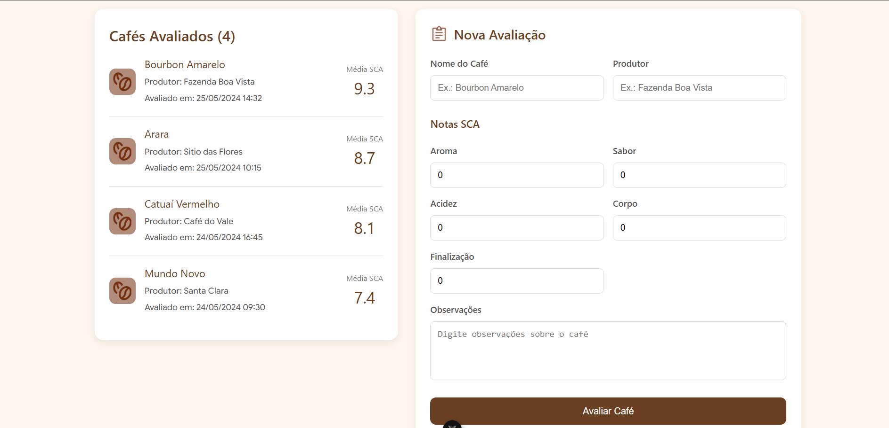
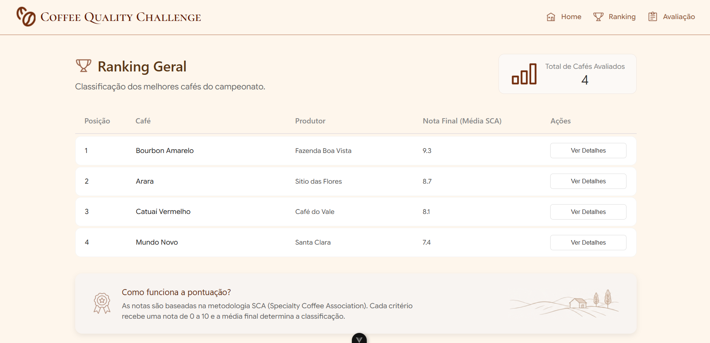

# ☕ Coffee Quality Challenge

Um sistema SPA (Single Page Application) moderno e responsivo desenvolvido em **Vue.js 3** para gerenciar avaliações sensoriais e classificar lotes de cafés especiais com base na metodologia da SCA (*Specialty Coffee Association*).

---

### 1. Página Principal (Home)

### 2. Cadastro e Listagem de Avaliações

### 3. Ranking Geral dos Cafés

---

## Conceitos de Vue.js utilizados no Projeto

* **Rotas (Vue Router):** Navegação estruturada entre as páginas de **Avaliações** (onde cadastramos e listamos) e o **Ranking**.
* **v-for:** Listagem dinâmica e automática de todos os cafés avaliados diretamente na tela.
* **v-model:** Vinculação de dados em tempo real para capturar as notas e textos digitados no formulário.
* **computed:** Propriedades reativas para gerar o ranking geral ordenando os cafés automaticamente da maior nota para a menor.
* **Funções Globais/Utilitários:** Uso da função `calcularNota` importada de um utilitário para somar ou fazer a média dos critérios (Aroma, Sabor, Acidez, Corpo e Finalização).

