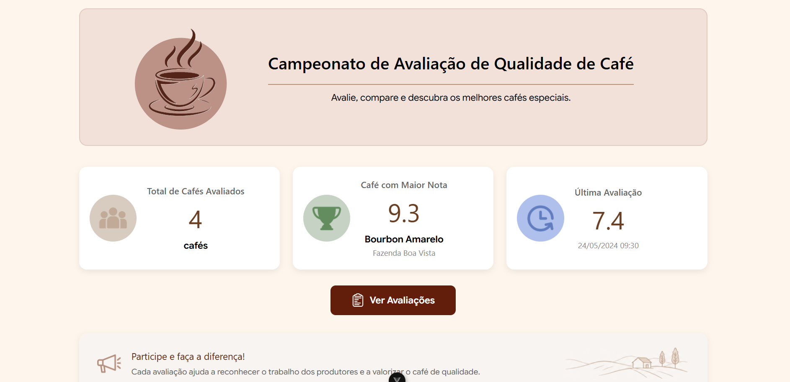

# ☕ Coffee Quality Challenge

Um sistema SPA (Single Page Application) moderno e responsivo desenvolvido em **Vue.js 3** para gerenciar avaliações sensoriais e classificar lotes de cafés especiais com base na metodologia da SCA (*Specialty Coffee Association*).

---

## 📸 Demonstração do Sistema (Screenshots)

> **Nota para a correção:** Substitua as imagens abaixo pelos caminhos corretos dos seus prints correspondentes dentro do repositório.

### 1. Página Principal (Home)


### 2. Cadastro e Listagem de Avaliações


### 3. Ranking Geral dos Cafés


---

## 🚀 Conceitos de Vue.js Utilizados no Projeto

Para atender aos critérios de avaliação e garantir boas práticas de desenvolvimento, os seguintes conceitos do ecossistema Vue foram aplicados:

### 1. Reatividade com Composition API (`<script setup>`)
Implementado em todas as Views e componentes do sistema para fornecer uma estrutura de código limpa, modular e focada na performance:
* **Uso do `ref()`:** Utilizado na `AvaliacaoView.vue` para capturar os estados reativos locais dos inputs do formulário de cadastro (`nome`, `produtor`, `aroma`, `sabor`, `acidez`, `corpo`, `finalizacao`, `observacoes`).
* **Uso do `computed()`:** * Na `HomeView.vue` para extrair indicadores de estatísticas em tempo real (`totalCafes`, `melhorCafe` e `ultimoCafe`).
  * Na `RankingView.vue` para gerar de forma automatizada a ordenação decrescente do ranking a partir da maior média calculada.

### 2. Diretivas Estruturais e de Dados
* **`v-model`:** Vinculação bidirecional de dados (*two-way data binding*) aplicada no formulário de `AvaliacaoView.vue` para sincronizar os inputs do avaliador com as variáveis reativas do Vue.
* **`v-for`:** Loop de renderização dinâmica para exibir as listas de cafés avaliados na tela de avaliações e as posições na tabela da tela de ranking.
* **`:key`:** Atribuição do identificador único `:key="cafe.id"` em todas as renderizações de listas para otimização do algoritmo de reconciliação do Virtual DOM.
* **Modificadores de Evento (`@click.prevent`)**: Aplicado no botão de submissão do formulário para disparar a função `adicionarCafe()` e simultaneamente anular o comportamento padrão de recarregamento da página HTML.

### 3. Gerenciamento de Estado Compartilhado (State Management)
Concentrado no arquivo `@/utils/cafes.js`, permitindo que a lista reativa `cafes` e a função utilitária global `calcularNota(cafe)` sejam importadas e consumidas simultaneamente pelas telas de Home, Avaliação e Ranking, mantendo os dados centralizados e síncronos.

### 4. Roteamento Dinâmico (Vue Router)
Configuração de rotas mapeadas de forma limpa em `router/index.js` utilizando o histórico web nativo (`createWebHistory`):
* `/` (Home)
* `/avaliacao` (Cadastro e Lista)
* `/ranking` (Classificação Geral)
* Utilização da tag `<RouterLink>` na Navbar, no Footer e em botões de ação para permitir uma navegação instantânea e fluida sem recarregar o navegador.

---

## 🛠️ Estrutura Arquitetural do Projeto

```text
src/
├── assets/          # Estilos e arquivos de mídia
├── router/
│   └── index.js     # Configuração das rotas do Vue Router
├── views/
│   ├── HomeView.vue # Painel de indicadores gerais
│   ├── AvaliacaoView.vue # Formulário e listagem das avaliações
│   └── RankingView.vue   # Tabela organizada por pontuação SCA
└── utils/
    └── cafes.js     # Estado global de dados e regras de negócio (Média SCA)